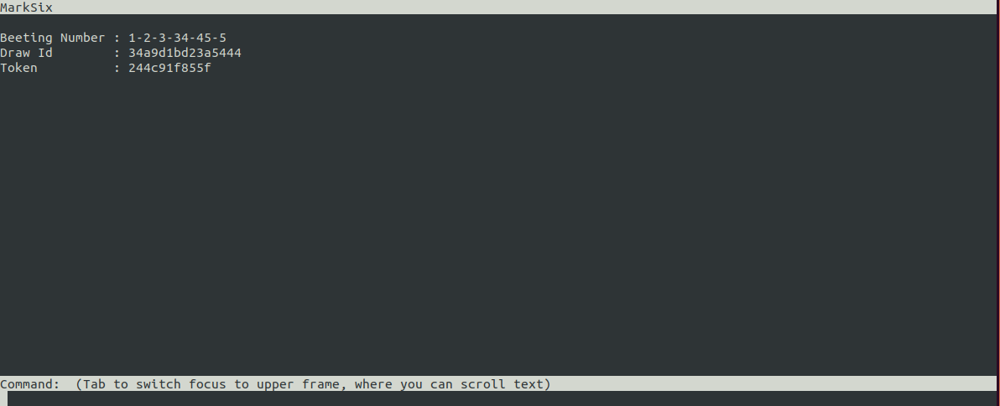

<div align="center" style="">

  <br><br>
</div>

# `Marksix`

This document highligth the manual or automatic deployment and installation of the marksix applications. The user of this guide should be familiar with the Linux environment,have basic understanding of Python, git, docker. 


## `Structure of the Project`
The Marksix project is comprised with 3 type of applications, the betting server, web server, chat application:

  - `Betting server`:

     It is a Standalone python application that handle any marksix betting data by default running on port 9001.


  - `Web server`:

    It is a python flask webserverapplication that handle any http marksix betting connecxion by default running on port 9002.

  - `Chat application`:

    It is a python terminal application that allow you to communicate with the betting server. 

     


## `Requirement`

- `Environment`
  - `Operating System` : GNU/Linux Ubuntu 18.04
  - `CPU`              : 4 core 3693 MHz
  - `Memory`           : 4GB or more

- `Software packages`

  | **Packages** | **Version** |
  |:-------------|:--------------------------------|
  | docker       | 18.09.7                         |
  | docker-compose   | 1.24.1                    |
  | python   | 3.6.9             |
  | git      | 2.17.1 |


## `Installation Guide`


  - `Automatic installation`

    Download the installation script following the below command.
    ```sh
    ~$ sudo curl -L "https://raw.githubusercontent.com/eirtdev/shell/master/marksix" -o /usr/local/bin/marksix
    ```
    Now you have successfuly download the installation script file, go ahead and make it executable with the below command.

    ```sh
    ~$ sudo chmod +x /usr/local/bin/marksix
    ```


    Now go ahead and run the below command and wait.

    ```sh
    ~$ marksix install
    ```

  - `Mannual Installation`

    - `Preparing the environment`

      - `Install all the require packages`

        - `Install docker`
            ```sh
            ~$ sudo apt-get install docker.io
            ```

        - `Install docker-compose`
            ```sh
            ~$ sudo curl -L "https://github.com/docker/compose/releases/download/1.24.1/docker-compose-$(uname -s)-$(uname -m)" -o /usr/local/bin/docker-compose
            ```
            Make the `docker-compose` file executable

            ```sh
            ~$ sudo chmod +x /usr/local/bin/docker-compose
            ```

        - `Install python3.6`

            ```sh
              ~$ sudo apt-get install -y software-properties-common && sudo add-apt-repository ppa:deadsnakes/ppa && sudo apt-get update && sudo apt-get install -y python3.6 && sudo apt-get install -y python3-pip
            ```
            ```sh
              ~$ python_path=`which python`
              ~$ python6_path=`which python3.6`
              ~$ sudo unlink $python_path
              ~$ sudo ln -s $python_path $python6_path
            ```

        - `Checking the pre-requisite packages installation`
          
            ```sh
            ~$ python --version
            Python 3.6.9
            ~$
            ```

            ```sh
            ~$ docker --version
            Docker version 19.03.6, build 369ce74a3c
            ~$
            ```

            ```sh
            ~$ docker-compose --version

            docker-compose version 1.24.1, build 4667896b
            ~$
            ```

            ```sh
            ~$ git --version
            git version 2.17.1
            ~$
            ```

    - `Clone the marksix repository`

      ```sh
       ~$ git clone https://github.com/eirtscience/marksix.git
      ```

      Move into the cloned folder and run the below command

      ```sh
      ~$ cd marksix && pip3 install -r package.txt
      ```

  - `Run Installation`

     - `Run Server`

        - `Run on the host`
           
           The below command will run the betting and the http server in the background.

          ```sh
          ~$ marksix run host
          ```
        - `Run with docker`

          ```sh
          ~$ marksix run docker
          ```

     - `Run Application`


        - `Automatic Simulator`

            In the cloned folder , run the file called `automate_client.py`.

            ```sh
            ~$ python automate_client.py
            ```
            The `automatic_client` client file will randomly simulate the betting user at the same time check the result of his betting.

        - `Http Request`

            you can also submit a betting number using a linux curl command

            - `Marksix Bet`

              ```sh
              ~$ curl -d '{"number":"21 11 33 5 7 1"}' -X POST http://127.0.0.1:9002/bet/ && echo

              {"betting_number": "1 2 3 4 5 6", "draw_status": "In progress", "token": "bb989f353fc", "draw_id": "1e28c17a7c1b4e2", "time_before_draw": 98}

              ```

            - `Marksix Ticket`

              On the same terminal to view the draw progress, use the below curl command. 
              ```sh
              ~$ curl http://127.0.0.1:9002/ticket/ && echo
              {"betting_number": "1 2 3 4 5 6", "draw_status": "In progress", "token": "bb989f353fc", "draw_id": "1e28c17a7c1b4e2", "time_before_draw": 20}
              ```

            - `Marksix Draw`
              You can also view the draw history using the below curl command.

              ```sh
              ~$ curl  http://127.0.0.1:9002/draw/ && echo

              [{"id": "df93be896f31406", "draw_number": "2-12-1-11-24-33", "special_number": 35, "date": "2020/07/21 15:40", "prize": "No winner"}, {"id": "e1365431b302471", "draw_number": "24-35-18-11-34-14", "special_number": 17, "date": "2020/07/21 15:40", "prize": "No winner"}]
              ```

        - `Chat Application`


            <div align="center" style="">
              <br><br>
            </div>

            ```sh
            ~$ python ./chat_app
            ```
            to submit a betting number "11-21-4-37-11-26", in the command terminal enter "bet 11-21-4-37-11-26". This chat terminal will be listen into the result event. Once the result of the draw is available the betting server will push the result into your terminal.

            You can also ask for the result by simply type "draw".

  - `Kill all the server`
    
    - `Kill all the server on the host`

      The below command will destroy the betting 
      ```sh
      ~$ marksix kill
      ```


